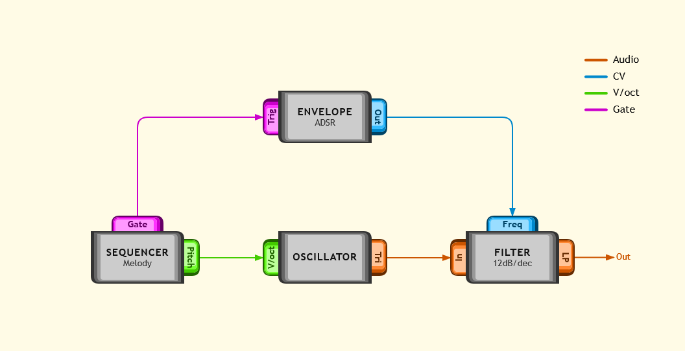

# Patch Diagrams for Mermaid

A [Mermaid](https://mermaid.js.org) plugin that adds a **patch diagram** type for drawing modular synthesizer patch diagrams. Define module interfaces, create instances of modules, and connect ports using a Mermaid-like syntax: 

```
patch
module Sequencer {
    +voct Pitch
    +gate Gate
}
module Oscillator {
    +voct V/oct
    +audio Tri
}
module Envelope {
    +gate Trig
    +cv Out
}
module Filter {
    +audio In
    +cv Freq
    +audio LP
}

Sequencer sq1["Melody"]
Oscillator osc1
Filter lpf1["12dB/dec"]
Envelope env1["ADSR"]

sq1:Pitch --> osc1:V/oct
sq1:Gate --> env1:Trig
osc1:out --> lpf1:In
env1:Out --> lpf1:Freq
lpf1:LP -->|Out|
```

Modules are rendered as blocks with typed ports (audio, CV, V/oct, gate). Connections are routed automatically using [ELK](https://eclipse.dev/elk/).



## Install

```bash
npm install mermaid-patch
```

Requires `mermaid ^11` as a peer dependency.

## Quick start

```js
import mermaid from 'mermaid';
import patch from 'mermaid-patch';

await mermaid.registerExternalDiagrams([patch]);
mermaid.initialize({ startOnLoad: true });
```

See [docs/usage.md](docs/usage.md) for HTML page and mkdocs-material integration examples.

## Documentation

| Doc | Contents |
|-----|----------|
| [docs/schema.md](docs/schema.md) | Diagram syntax and examples |
| [docs/config.md](docs/config.md) | Theme and layout configuration |
| [docs/usage.md](docs/usage.md) | Integration guides |

## License

MIT — see [LICENSE](LICENSE).
